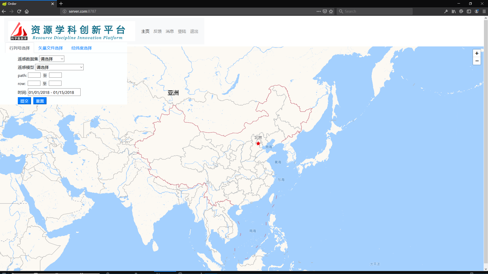
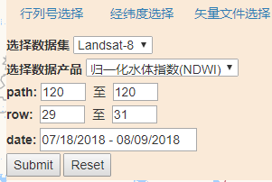
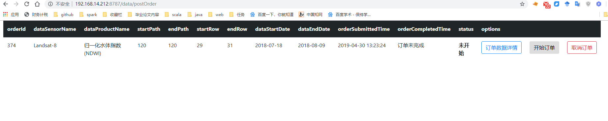
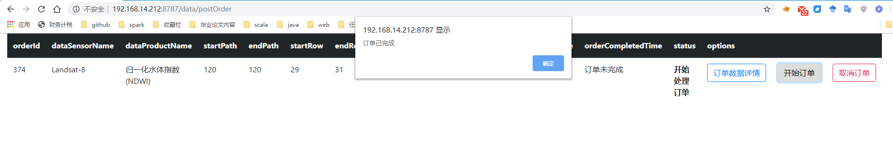
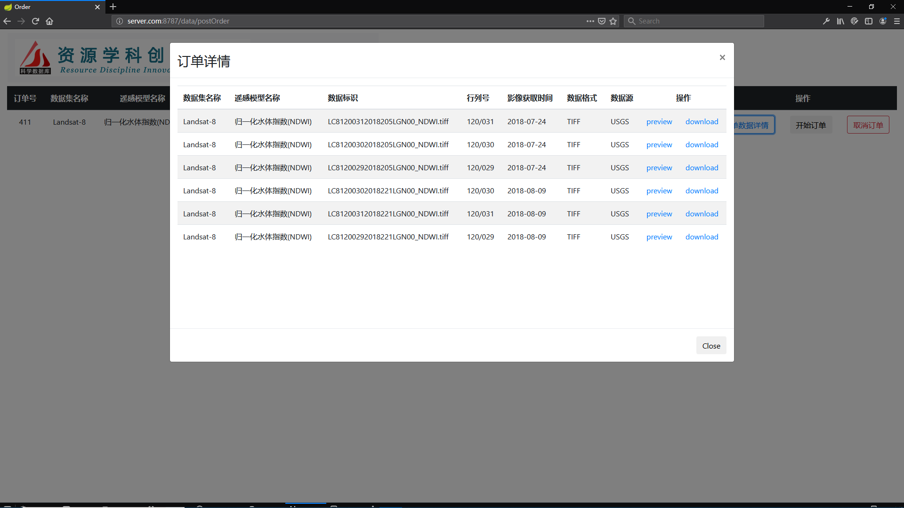
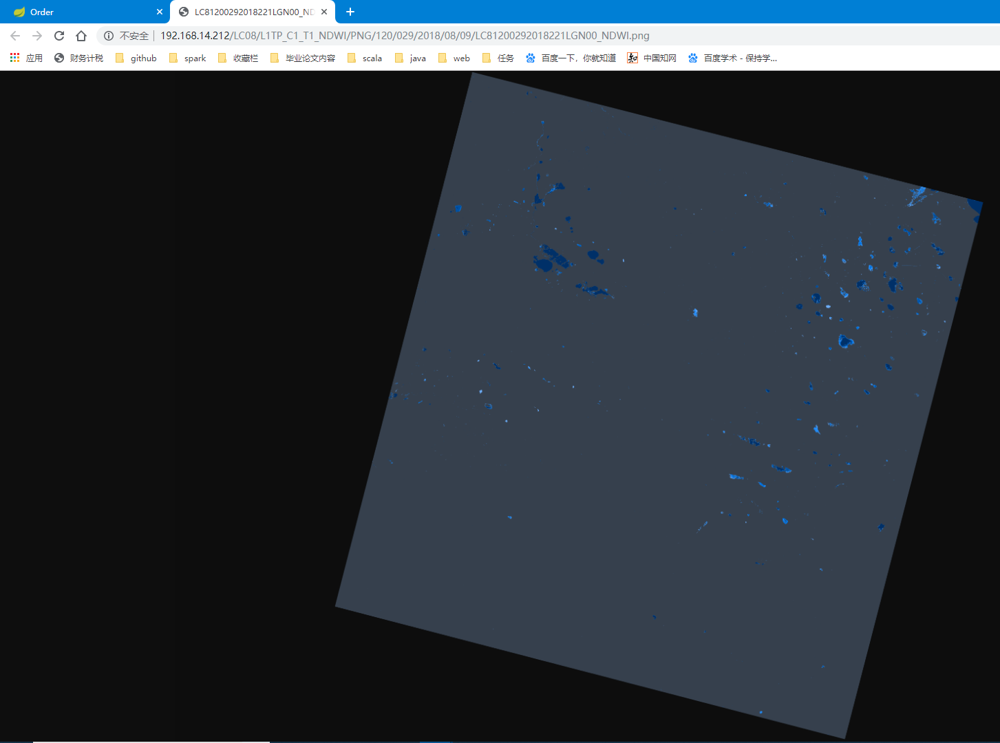

##程序说明
####程序准备  
1. 下载源码 `git clone http://159.226.110.179/wanghl/EOSprite.git`   
2. 打包程序，进入主目录，EOSprite目录下 `mvn clean package -Dmaven.test.skip=true`跳过test目录源码编译和测试     
3. 进入EOSprite/eos-data/target目录 `java -jar eos-data-0.0.1-SNAPSHOT.jar` 启动项目

####启动程序
1. 程序入口`http://192.168.14.212:8787`

2. 选择行列号，时间，以及数据产品(目前只支持Landsat-8数据集，以及NDVI和NDWI数据产品)，选择完毕后提交订单。

3. 测试订单信息如图所示:

4. 提交订单，跳转到订单页面

5. 点击开始订单，开始数据处理任务，数据处理完成弹窗提醒，同时更新订单状态和订单完成时间

6. 数据详情页，包含了数据下载链接，以及数据预览图片。实现了订单信息的动态更新，后端数据产品生成，前端更新数据预览和下载连接。
**preview** 包含了数据预览信息，点击开启新窗口，提供图片预览。**download**点击开始数据下载任务

7. 目前实现的数据预览, 后期考虑与网络地图整合显示。

